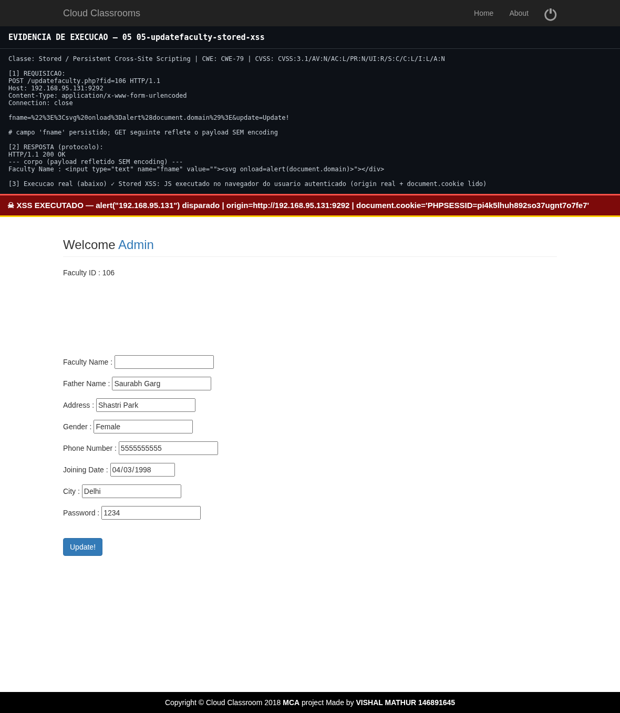
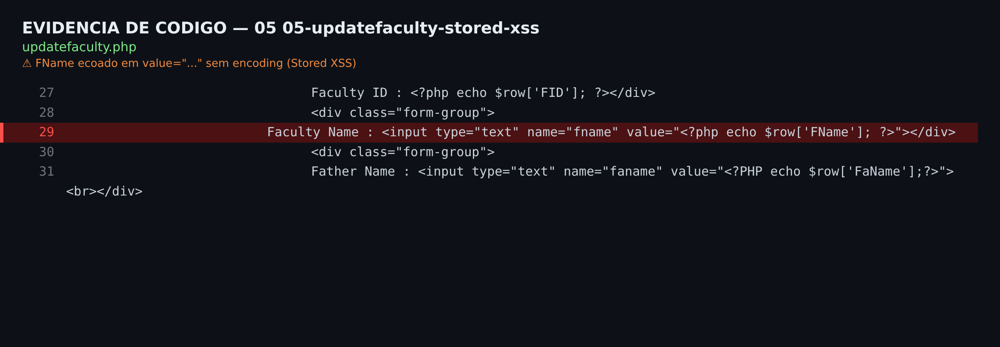

# CloudClassroom-PHP-Project 1.0 — Stored XSS em updatefaculty.php

| Campo | Valor |
|-------|-------|
| **ID interno** | CC-2026-05 |
| **Produto** | CloudClassroom-PHP-Project 1.0 |
| **Fornecedor** | Vishal Mathur (`mathurvishal`) |
| **Arquivo(s)** | `updatefaculty.php` |
| **Classe** | Stored / Persistent Cross-Site Scripting |
| **CWE** | CWE-79: Cross-site Scripting |
| **OWASP** | A03:2021 – Injection |
| **Método / Parâmetro(s)** | POST — `fname`, `faname`, `addrs`, `gender`, `city`, `pass` |
| **Autenticação** | Nenhuma para injetar (via item 00) |
| **Interação do usuário** | Requerida (vítima abre a página que renderiza o dado) |
| **CVSS v3.1** | **6.1 (Médio)** — `CVSS:3.1/AV:N/AC:L/PR:N/UI:R/S:C/C:L/I:L/A:N` |
| **EPSS** | N/A (sem CVE) — estimativa baixa. |
| **Status público** | Inédito |

---

## 1. Resumo executivo

Os campos `fname`, `faname`, `addrs`, `gender`, `city`, `pass` são persistidos sem sanitização e reexibidos em atributo `value="..."` sem HTML-encoding. FName é varchar(50) (comporta payloads completos). Tela administrativa → XSS no contexto do admin.

## 2. Pré-condições

Nenhuma para injetar (item 00). Vítima autenticada (admin/faculty) precisa visualizar o registro.

## 3. Análise de código (causa-raiz)

**`updatefaculty.php`**

```php
<input ... name="fname" value="<?php echo $row[...]; ?>">
```

## 4. Passo a passo de exploração

1. Enviar POST para `updatefaculty.php` gravando o payload de breakout no campo `fname`.
2. Payload: `"><svg onload=alert(1)>` (quebra o atributo value).
3. Abrir novamente a página; o payload é refletido SEM encoding e executa.
4. Encadear com o cookie sem HttpOnly (item 24) para roubo de sessão do admin.

## 5. Prova de conceito (PoC)

Script executável e não-destrutivo: **`poc.sh`** (uso: `bash poc.sh [http://alvo:porta]`).

```bash
# ciclo não-destrutivo (captura->injeta->verifica->restaura):
python3 ../_lib/xss_poc.py "http://127.0.01:9292" "updatefaculty.php?..." \
  fname '"><svg onload=alert(1)>' --fields fname,faname,addrs,gender,city,pass
```

**Evidência observada no laboratório (http://127.0.01:9292/):**

```
payload refletido SEM encoding: "><svg onload=alert(1)>
```

### 5.1 Evidência visual (re-validação ao vivo em 2026-08-02)

Ataque reproduzido ao vivo contra http://127.0.01:9292/ de forma não-destrutiva (leituras/erro-based, e injeções de estado com restauração automática do valor original).

**a) Execução no navegador** — resposta real do servidor renderizada no Chromium, com faixa de evidência (requisição + payload + veredito):



**b) Linha de código vulnerável** — trecho do código-fonte com o *sink* destacado (`updatefaculty.php`):



## 6. Impacto

Execução de JavaScript no contexto de administradores/professores autenticados: roubo de cookie de sessão, ações CSRF-como-vítima, pivô para tomada de conta administrativa.

## 7. Avaliação de severidade (CVSS v3.1)

Vetor: `CVSS:3.1/AV:N/AC:L/PR:N/UI:R/S:C/C:L/I:L/A:N` — **Base 6.1 (Médio)**

| Métrica | Valor |
|---|---|
| Attack Vector (AV) | Network (N) |
| Attack Complexity (AC) | Low (L) |
| Privileges Required (PR) | None (N) |
| User Interaction (UI) | Required (R) |
| Scope (S) | Changed (C) |
| Confidentiality (C) | Low (L) |
| Integrity (I) | Low (L) |
| Availability (A) | None (N) |

**EPSS:** N/A (sem CVE) — estimativa baixa.

## 8. Remediação

- Codificar toda saída dinâmica com `htmlspecialchars($v, ENT_QUOTES, 'UTF-8')` no contexto correto.
- Validar/limitar o conteúdo na entrada e usar Content-Security-Policy.
- Prepared statements na persistência (defesa em profundidade).

## 9. Ineditismo / pesquisa de duplicidade

Nenhuma CVE pública para este arquivo/parâmetro no produto Vishal Mathur nem no código-base gêmeo 'CodeAstro Online Classroom'. Verificado em NVD/cvefeed em 2026-08-02.

## 10. Referências

- https://cwe.mitre.org/
- https://www.first.org/cvss/calculator/3.1
- https://cvefeed.io/vuln/product/161371/vishalmathurcloudclassroom-php_project/

## 11. Cronologia

- 2026-08-02 — Descoberta (análise estática) e confirmação dinâmica no laboratório.
- 2026-08-02 — Preparação do pacote de divulgação (este relatório).

---
*Relatório gerado a partir de `_lib/findings_data.py` (fonte única). Pesquisador: oliveira.luanalmeida@gmail.com.*
